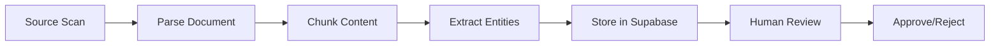
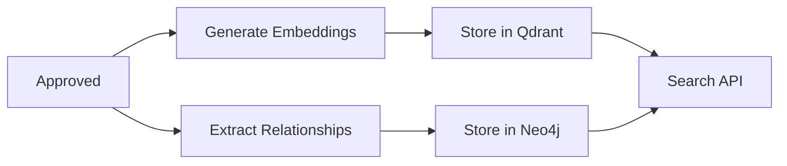

# Post-Approval Publishing Pipeline Implementation Plan

## Executive Summary
The current CocoIndex ingestion portal successfully processes documents through parsing, chunking, entity extraction, and human review, but lacks the critical final step: publishing approved content to vector (Qdrant) and graph (Neo4j) databases for retrieval. This document outlines the implementation plan to complete the pipeline while maintaining architectural consistency.

## Current State Analysis

### Working Pipeline


### Missing Pipeline


## Architectural Alignment

### Core Principles (Maintained)
1. **Supabase as Source of Truth**: All data flows through Supabase first
2. **Celery for Async Processing**: Background tasks handle heavy computation
3. **State Machine Integrity**: Document states follow defined transitions
4. **Service Layer Abstraction**: Business logic encapsulated in service classes
5. **SSE for Real-time Updates**: Progress streamed to frontend
6. **Separation of Concerns**: Review workflow remains independent from publishing

### New Architectural Components
1. **Publishing Pipeline**: Separate Celery task chain for post-approval processing
2. **Publishing State**: New document state to track publishing status
3. **Retry Mechanism**: Resilient handling of external service failures
4. **Batch Processing**: Efficient embedding generation and storage

## Implementation Phases

### Phase 1: Foundation (Week 1)
**Priority: CRITICAL**
**Goal**: Establish post-approval pipeline infrastructure

#### 1.1 Update Document State Model
```python
# app/models/document.py
class DocumentState(str, Enum):
    # Existing states
    pending = "pending"
    processing = "processing"
    pending_review = "pending_review"
    approved = "approved"
    rejected = "rejected"
    failed = "failed"

    # New states
    publishing = "publishing"
    published = "published"
    publish_failed = "publish_failed"
```

#### 1.2 Create Publishing Task
```python
# app/tasks/document_tasks.py
@celery_app.task(bind=True, name="publish_approved_document")
def publish_approved_document(self, document_id: str) -> Dict[str, Any]:
    """
    Publish approved document to vector and graph stores
    """
    # Update state to publishing
    # Generate embeddings
    # Store in Qdrant
    # Store in Neo4j
    # Update state to published
```

#### 1.3 Update Approval Endpoint
```python
# app/api/documents_review.py
@router.post("/{document_id}/approve")
async def approve_document(document_id: str):
    # Existing approval logic
    # ...
    # Trigger publishing
    publish_approved_document.delay(document_id)
```

### Phase 2: Embedding Pipeline (Week 1-2)
**Priority: CRITICAL**
**Goal**: Replace placeholder with real embedding generation

#### 2.1 Fix Embedding Generation Task
```python
# app/tasks/document_tasks.py
def generate_embeddings(self, chunk_result: Dict[str, Any], job_id: str):
    """Generate real embeddings using OpenAI"""
    from app.services.embedding_service import EmbeddingService

    embedding_service = EmbeddingService()
    chunks = self.supabase.get_chunks(document_id)

    # Batch process for efficiency (max 100 chunks per API call)
    for batch in chunks_in_batches(chunks, 100):
        embeddings = await embedding_service.embed_batch(
            [chunk.content for chunk in batch]
        )

        # Store embedding vectors temporarily in chunk metadata
        for chunk, embedding in zip(batch, embeddings):
            self.supabase.update_chunk(chunk.id, {
                "embedding_vector": embedding.embedding,
                "embedding_model": embedding.model,
                "embedding_dimensions": embedding.dimensions
            })
```

#### 2.2 Create Qdrant Storage Function
```python
# app/services/qdrant_service.py
async def store_document_embeddings(self, document_id: str) -> bool:
    """Store all document embeddings in Qdrant"""
    chunks = self.supabase.get_chunks_with_embeddings(document_id)

    points = []
    for chunk in chunks:
        point = PointStruct(
            id=chunk.id,
            vector=chunk.embedding_vector,
            payload={
                "document_id": document_id,
                "chunk_number": chunk.chunk_number,
                "content": chunk.content,
                "metadata": chunk.metadata,
                "parent_chunk_id": chunk.parent_chunk_id
            }
        )
        points.append(point)

    # Upsert in batches
    await self.client.upsert(
        collection_name="document_chunks",
        points=points
    )
```

### Phase 3: Graph Storage (Week 2)
**Priority: HIGH**
**Goal**: Store approved entities and relationships in Neo4j

#### 3.1 Create Neo4j Storage Function
```python
# app/services/neo4j_service.py
async def store_document_graph(self, document_id: str) -> bool:
    """Store approved entities and relationships in Neo4j"""

    # Get approved canonical entities
    entities = self.supabase.get_canonical_entities(document_id, approved_only=True)

    # Get approved relationships
    relationships = self.supabase.get_canonical_relationships(document_id)

    # Batch create nodes
    for entity in entities:
        await self.create_node(
            label=entity.type,
            properties={
                "id": entity.id,
                "name": entity.name,
                "canonical_name": entity.canonical_name,
                "description": entity.description,
                "document_ids": [document_id]
            }
        )

    # Batch create relationships
    for rel in relationships:
        await self.create_relationship(
            source_id=rel.source_entity_id,
            target_id=rel.target_entity_id,
            relationship_type=rel.relationship_type,
            properties={
                "confidence": rel.confidence,
                "document_id": document_id
            }
        )
```

### Phase 4: Search Service Hardening (Week 2-3)
**Priority: HIGH**
**Goal**: Handle empty collections gracefully

#### 4.1 Add Collection Checks
```python
# app/services/search_service.py
async def vector_search(self, query: str, **kwargs):
    """Enhanced vector search with fallback"""
    try:
        # Check if collection exists and has data
        collection_info = await self.qdrant.get_collection("document_chunks")
        if collection_info.points_count == 0:
            logger.warning("Qdrant collection empty, falling back to Supabase")
            return await self.supabase_text_search(query, **kwargs)

        # Proceed with vector search
        # ...
    except Exception as e:
        logger.error(f"Qdrant search failed: {e}")
        return await self.supabase_text_search(query, **kwargs)
```

#### 4.2 Implement Supabase Fallback Search
```python
# app/services/supabase_service.py
def text_search(self, query: str, limit: int = 10) -> List[Dict]:
    """Full-text search in Supabase as fallback"""
    return self.client.table("chunks") \
        .select("*") \
        .text_search("content", query) \
        .limit(limit) \
        .execute()
```

### Phase 5: Initialization & Migration (Week 3)
**Priority: MEDIUM**
**Goal**: Enable backfilling and collection setup

#### 5.1 Create Initialization Endpoints
```python
# app/api/bridge.py
@router.post("/initialize-collections")
async def initialize_collections():
    """Create required Qdrant collections"""
    await qdrant_service.create_collection(
        name="document_chunks",
        vector_size=1536,  # text-embedding-3-small
        distance=Distance.COSINE
    )

@router.post("/republish-approved")
async def republish_approved_documents():
    """Republish all approved documents to stores"""
    approved_docs = supabase.get_documents_by_state("approved")

    for doc in approved_docs:
        publish_approved_document.delay(doc.id)
```

### Phase 6: Testing & Monitoring (Week 3-4)
**Priority: HIGH**
**Goal**: Ensure reliability and observability

#### 6.1 Integration Tests
```python
# tests/test_publishing_pipeline.py
async def test_full_publishing_pipeline():
    # Create test document
    # Process through pipeline
    # Approve document
    # Wait for publishing
    # Verify in Qdrant
    # Verify in Neo4j
    # Test search functionality
```

#### 6.2 Add Monitoring
- Publishing task duration metrics
- Embedding generation costs tracking
- Qdrant storage success rates
- Neo4j write performance
- Search latency by type (vector/graph/hybrid)

## Rollout Strategy

### Stage 1: Development Environment
1. Deploy embedding generation fix
2. Test with single document
3. Verify Qdrant storage
4. Test search fallback

### Stage 2: Staging Environment
1. Initialize collections
2. Process 10 test documents
3. Verify search results
4. Load test with 100 documents

### Stage 3: Production Deployment
1. Deploy during low-traffic window
2. Initialize empty collections
3. Process new documents normally
4. Backfill approved documents in batches

## Risk Mitigation

### Identified Risks
1. **OpenAI API Rate Limits**: Implement exponential backoff and queuing
2. **Large Document Memory Issues**: Process chunks in batches
3. **Qdrant Connection Failures**: Implement circuit breaker pattern
4. **Neo4j Transaction Timeouts**: Batch operations with smaller transactions
5. **Cost Overruns**: Add cost estimation before processing

### Rollback Plan
1. Publishing pipeline can be disabled via feature flag
2. Search falls back to Supabase automatically
3. No changes to existing review workflow
4. Publishing state allows resuming after fixes

## Success Criteria

### Functional Requirements
- [ ] All approved documents generate real embeddings
- [ ] Embeddings stored successfully in Qdrant
- [ ] Approved entities/relationships stored in Neo4j
- [ ] Vector search returns relevant results
- [ ] Graph search traverses relationships correctly
- [ ] Hybrid search combines both sources

### Performance Requirements
- [ ] Publishing completes within 2 minutes for average document
- [ ] Search latency remains under 200ms
- [ ] Embedding generation costs tracked and within budget
- [ ] System handles 100 concurrent documents

### Quality Requirements
- [ ] 99% publishing success rate
- [ ] Zero data loss during publishing
- [ ] Graceful degradation when services unavailable
- [ ] Complete audit trail for publishing pipeline

## Timeline

| Week | Phase | Deliverables |
|------|-------|--------------|
| 1 | Foundation + Embedding Start | Publishing task, state model, embedding fix |
| 2 | Embedding Complete + Graph | Qdrant storage, Neo4j storage |
| 3 | Search + Initialization | Search hardening, migration tools |
| 4 | Testing + Deployment | Integration tests, staging deployment |
| 5 | Production + Monitoring | Production rollout, observability |

## Appendix A: File Changes Summary

### Modified Files
1. `app/models/document.py` - Add publishing states
2. `app/tasks/document_tasks.py` - Fix embeddings, add publishing task
3. `app/api/documents_review.py` - Trigger publishing on approval
4. `app/services/search_service.py` - Add fallback search
5. `app/services/qdrant_service.py` - Add bulk storage methods
6. `app/services/neo4j_service.py` - Add entity/relationship storage
7. `app/api/bridge.py` - Add initialization endpoints

### New Files
1. `app/tasks/publishing_tasks.py` - Dedicated publishing pipeline (optional)
2. `tests/test_publishing_pipeline.py` - Integration tests
3. `scripts/migrate_approved_docs.py` - Migration utility

## Appendix B: Configuration Changes

### Environment Variables
```bash
# Existing (verify presence)
OPENAI_API_KEY=sk-...
QDRANT_URL=http://localhost:6333
QDRANT_API_KEY=...
NEO4J_URI=bolt://localhost:7687
NEO4J_USERNAME=neo4j
NEO4J_PASSWORD=...

# New (add if needed)
EMBEDDING_BATCH_SIZE=100
PUBLISHING_TIMEOUT_SECONDS=120
ENABLE_PUBLISHING_PIPELINE=true
SEARCH_FALLBACK_ENABLED=true
```

## Appendix C: Database Schema Changes

### Supabase Additions
```sql
-- Add embedding metadata to chunks table
ALTER TABLE chunks ADD COLUMN embedding_vector JSONB;
ALTER TABLE chunks ADD COLUMN embedding_model TEXT;
ALTER TABLE chunks ADD COLUMN embedding_dimensions INTEGER;
ALTER TABLE chunks ADD COLUMN embedded_at TIMESTAMP;

-- Add publishing tracking to documents
ALTER TABLE documents ADD COLUMN published_at TIMESTAMP;
ALTER TABLE documents ADD COLUMN publish_attempts INTEGER DEFAULT 0;
ALTER TABLE documents ADD COLUMN last_publish_error TEXT;
```

### Qdrant Collection Schema
```json
{
  "collection_name": "document_chunks",
  "vector_size": 1536,
  "distance": "Cosine",
  "indexes": [
    {"field": "document_id", "type": "keyword"},
    {"field": "chunk_number", "type": "integer"},
    {"field": "parent_chunk_id", "type": "keyword"}
  ]
}
```

### Neo4j Constraints
```cypher
CREATE CONSTRAINT entity_id IF NOT EXISTS
FOR (e:Entity) REQUIRE e.id IS UNIQUE;

CREATE INDEX entity_name IF NOT EXISTS
FOR (e:Entity) ON (e.canonical_name);

CREATE INDEX entity_document IF NOT EXISTS
FOR (e:Entity) ON (e.document_ids);
```

## Next Steps

1. Review and approve this implementation plan
2. Create feature branch: `feature/post-approval-publishing`
3. Implement Phase 1 (Foundation)
4. Deploy to development environment
5. Begin Phase 2 (Embeddings) after validation

---

*Document Version: 1.0*
*Created: 2025-09-25*
*Status: Draft - Pending Review*