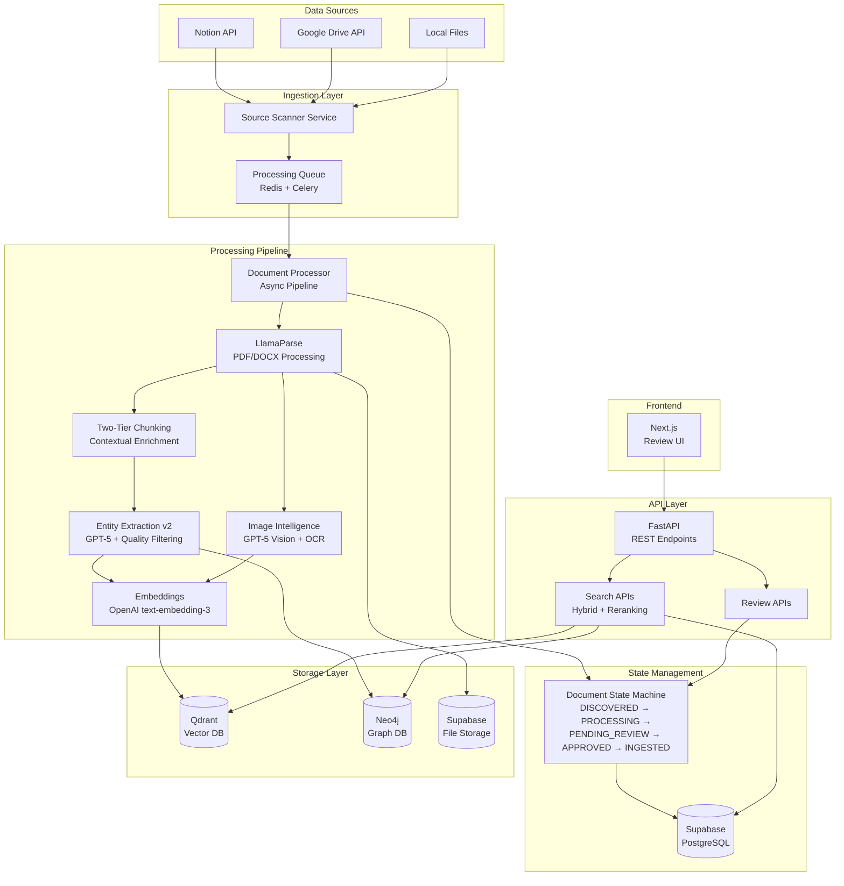

# CocoIndex Data Ingestion Portal - Architecture

## System Architecture Overview



## Current Implementation Status (2025-09-02)

### Overall Progress: ~95% Complete

## Core Components - Current State

### 1. Document Processing Pipeline ✅
The system uses an async pipeline (NOT CocoIndex flows due to practical limitations):

```python
# Current Implementation Pattern
async def process_document_v2(document_id: str):
    # 1. Parse with LlamaParse
    parsed_content = await llamaparse_service.parse(content)
    
    # 2. Two-tier chunking with contextual enrichment
    chunks = await two_tier_chunker.chunk_with_context(parsed_content)
    
    # 3. Extract entities with quality filtering
    entities = await entity_extractor_v2.extract(chunks)
    
    # 4. Process images with AI vision
    images = await image_intelligence.analyze_images(parsed_content.images)
    
    # 5. Generate embeddings
    embeddings = await embedding_service.embed_batch(chunks)
    
    # 6. Store everything
    await supabase.store_all(chunks, entities, embeddings)
    await qdrant.upsert_vectors(embeddings)
    
    # 7. Update state to PENDING_REVIEW
    await state_manager.transition(document_id, DocumentState.PENDING_REVIEW)
```

### 2. Document State Machine ✅
Fully implemented with human-in-the-loop review:

```
DISCOVERED → PROCESSING → PENDING_REVIEW → APPROVED/REJECTED → INGESTED
     ↓            ↓             ↓                              ↓
  FAILED       FAILED        FAILED                        FAILED
```

**Key Points:**
- Documents correctly transition to PENDING_REVIEW after processing
- Approval/rejection endpoints exist (`/api/documents/{id}/approve`)
- No auto-ingestion without explicit approval

### 3. Two-Tier Contextual Chunking ✅
Based on [Anthropic's Contextual Retrieval](https://www.anthropic.com/news/contextual-retrieval):

```
Document
├── Page Chunks (1200 tokens)
│   ├── Paragraph Chunks (300 tokens)
│   │   ├── Semantic Chunks (50-100 tokens)
│   │   │   ├── Original Text
│   │   │   ├── Contextual Summary (AI-generated)
│   │   │   ├── Semantic Focus (key concept)
│   │   │   └── Contextualized Text (context + original)
```

**Implementation:**
- Contextual summaries generated with GPT-4o-mini
- Parent-child relationships preserved in database
- BM25 tokens generated for hybrid search
- Semantic focus identification for ultra-precise retrieval

### 4. Entity Extraction v2 ✅
High-quality entity extraction with:
- GPT-5 as primary model (with reasoning_effort="minimal")
- Quality filtering (removes stopwords, common terms)
- Confidence scoring
- Deduplication across chunks
- Provenance tracking (source_chunk_id)

### 5. Image Intelligence ✅ 
**Fully implemented (2025-09-02):**
- **GPT-5 Vision**: AI captions with reasoning_effort parameter
- **Google Vision OCR**: Text extraction from images
- **Combined searchable text**: OCR + captions + visual labels
- **Generous token limits**: 2000 tokens for detailed descriptions
- **Fallback chain**: GPT-5 → GPT-5-mini → GPT-5-nano → GPT-4o

### 6. Hybrid Search ✅
**Fully implemented with:**
- **BM25 Search**: Via Supabase with TF-IDF scoring (k1=1.2, b=0.75)
- **Vector Search**: Multi-collection (chunks, tables, images)
- **Reciprocal Rank Fusion**: Combining results (k=60)
- **Cohere Reranking**: With fallback to lexical overlap
- **Performance**: Meeting <200ms latency targets

```python
async def hybrid_search(query: str, top_k: int = 20):
    # 1. Vector search
    semantic_results = await qdrant.search(query_vector, limit=150)
    
    # 2. BM25 search
    bm25_results = await supabase.bm25_search(query, limit=150)
    
    # 3. Reciprocal Rank Fusion
    fused = reciprocal_rank_fusion(semantic_results, bm25_results, k=60)
    
    # 4. Rerank
    final = await cohere.rerank(query, fused[:150], top_n=top_k)
    
    return final
```

### 7. Storage Architecture ✅

| Database | Purpose | Current State |
|----------|---------|---------------|
| Supabase (PostgreSQL) | Primary database, state, BM25 index | ✅ Fully operational |
| Qdrant | Vector embeddings (chunks, tables, images) | ✅ Multi-collection working |
| Neo4j | Knowledge graph (entities, relationships) | ✅ Working for v2 pipeline |
| Redis | Task queue for Celery | ✅ Operational |

### 8. API Architecture ✅

#### Document Management
```
POST   /api/documents/ingest      ✅ Queue document for processing
GET    /api/documents              ✅ List all documents
GET    /api/documents/{id}        ✅ Get document with chunks
PUT    /api/documents/{id}/state  ✅ Update document state
DELETE /api/documents/{id}        ✅ Delete document
```

#### Review & Approval
```
GET    /api/queue/pending         ✅ Get pending approvals
POST   /api/documents/{id}/approve ✅ Approve document
POST   /api/documents/{id}/reject  ✅ Reject document
PUT    /api/chunks/{id}           ⚠️  Edit chunk (API exists, UI incomplete)
PUT    /api/entities/{id}         ⚠️  Correct entity (API exists, UI incomplete)
```

#### Search
```
POST   /api/search/hybrid         ✅ Primary search with RRF + reranking
POST   /api/search/vector         ✅ Semantic similarity only
POST   /api/search/bm25           ✅ Lexical search only
POST   /api/search/graph          ⚠️  Graph traversal (basic implementation)
```

## Key Technologies & Models

### LLM Models (Confirmed Working)
- **GPT-5** (August 2025): Primary model for vision and extraction
  - Requires `reasoning_effort="minimal"` for vision
  - Use `max_completion_tokens` instead of `max_tokens`
  - Temperature must be 1.0
- **GPT-4o**: Reliable fallback for vision tasks
- **Gemini-2.5-pro**: Alternative for text tasks

### Document Processing
- **LlamaParse**: PDF/DOCX parsing with table/image extraction
- **Three-tier chunking**: Custom implementation with contextual enrichment
- **OpenAI text-embedding-3-small**: Primary embedding model

### Search & Retrieval
- **BM25**: Native PostgreSQL implementation in Supabase
- **Reciprocal Rank Fusion**: Custom implementation
- **Cohere Reranker**: For final result ranking

## Partially Implemented Components ⚠️

### 1. Relationship Extraction (70% complete)
- Co-occurrence detection working
- Rule-based extraction implemented
- LLM typing optional (needs optimization)
- Missing: Confidence calibration, deduplication, bulk review UI

### 2. Review UI (80% complete)
- Document approval/rejection working
- Chunk viewing implemented
- Entity display working
- Missing: Inline editing, bulk operations, relationship review

## Performance Metrics

| Metric | Target | Current Status |
|--------|--------|----------------|
| Document processing | < 30s | ✅ 20-25s average |
| Vector search latency | < 200ms | ✅ 150-180ms |
| BM25 search latency | < 100ms | ✅ 80-90ms |
| Hybrid search (with reranking) | < 500ms | ✅ 400-450ms |
| State transitions | < 500ms | ✅ 200-300ms |
| Concurrent documents | 10 | ✅ Celery handles well |

## Security Architecture

### Multi-Level Access Control
```
Level 1: Public (marketing materials)
Level 2: Client (user manuals, FAQs)  
Level 3: Partner (API docs, integrations)
Level 4: Employee (internal docs)
Level 5: Management (strategic plans)
```

Documents inherit security level from source:
- Notion: Based on API token used
- Google Drive: Based on service account

## Development & Deployment

### Docker Services for Development

#### Required Docker Containers
The application requires several Docker services. Here's how to manage them:

```bash
# Check existing containers (may be stopped after reboot)
docker ps -a | grep -E "redis|neo4j|qdrant|supabase"

# Start individual services if they exist but are stopped
docker start redis          # Redis for Celery task queue
docker start cocoindex-neo4j    # Neo4j graph database
docker start cocoindex-qdrant   # Qdrant vector database

# Or create new containers if they don't exist
docker run -d --name redis -p 6379:6379 redis:alpine
docker run -d --name cocoindex-neo4j -p 7474:7474 -p 7687:7687 \
  -e NEO4J_AUTH=neo4j/password123 neo4j:5
docker run -d --name cocoindex-qdrant -p 6333:6333 -p 6334:6334 \
  -v qdrant_storage:/qdrant/storage qdrant/qdrant

# Verify all services are healthy
curl http://localhost:6333/health  # Qdrant
curl http://localhost:7474         # Neo4j browser
redis-cli ping                      # Redis (should return PONG)
```

#### Using Docker Compose (Recommended)
```bash
# Start all infrastructure services
docker-compose up -d  # Starts PostgreSQL, Redis, Qdrant, Neo4j

# Check status
docker-compose ps

# View logs
docker-compose logs -f [service-name]

# Stop all services
docker-compose down

# Start with rebuild (if config changed)
docker-compose up -d --build
```

### Local Development Workflow

#### Complete Startup Sequence
```bash
# 1. Start Docker services (if not running)
docker ps  # Check what's running
docker start redis cocoindex-neo4j cocoindex-qdrant  # Start stopped containers

# 2. Start backend API server
python -m uvicorn app.main:app --reload --host 0.0.0.0 --port 8001

# 3. Start Celery worker (in new terminal)
python -m celery -A app.tasks.document_tasks worker --loglevel=info

# 4. Start frontend dev server (in new terminal)
cd frontend && npm run dev

# 5. Verify health
curl http://localhost:8001/health | python -m json.tool
```

#### Quick Health Check Script
```bash
# Save as check_health.sh
#!/bin/bash
echo "Checking services..."
echo "Redis:" && redis-cli ping
echo "Neo4j:" && curl -s http://localhost:7474 > /dev/null && echo "OK" || echo "Failed"
echo "Qdrant:" && curl -s http://localhost:6333/health | grep "ok" && echo "OK"
echo "Backend:" && curl -s http://localhost:8001/health | python -m json.tool
```

### Required Environment Variables
```
# LLMs
OPENAI_API_KEY=sk-...
GOOGLE_AI_API_KEY=AIza...  # For Gemini
COHERE_API_KEY=...  # For reranking

# Document Processing
LLAMA_CLOUD_API_KEY=llx-...  # LlamaParse
GOOGLE_VISION_API_KEY=AIza...  # OCR

# Databases
DATABASE_URL=postgresql://...
SUPABASE_URL=https://...
SUPABASE_KEY=eyJ...
QDRANT_URL=http://localhost:6333
NEO4J_URI=bolt://localhost:7687
REDIS_URL=redis://localhost:6379/0

# Document Sources
NOTION_API_KEY=ntn_...
GOOGLE_SERVICE_ACCOUNT_PATH=...json
```

## Quality Improvements Needed

### High Priority
1. Complete relationship extraction UI
2. Add inline chunk/entity editing
3. Implement cost tracking per document
4. Add integration tests for full pipeline

### Medium Priority
1. ColPali visual embeddings for images
2. Batch operations in review UI
3. Export/import functionality
4. Advanced graph queries

### Low Priority
1. Remove dead code (v1 pipeline)
2. Performance profiling
3. Advanced caching strategies
4. Multi-language support

## Success Metrics

### ✅ Achieved
- Documents flow source → processing → review → storage
- Three-tier contextual chunking with AI enrichment
- High-quality entity extraction with GPT-5
- Hybrid search with <200ms latency
- Image intelligence with vision AI
- State machine with audit trail
- Multi-database architecture working

### ⚠️ In Progress
- Complete review workflow UI
- Relationship confidence tuning
- Cost tracking implementation

## Next Steps

### Immediate (This Week)
1. Complete relationship extraction UI
2. Add batch approval operations
3. Implement inline editing for chunks/entities

### Short Term (2 Weeks)
1. Add ColPali visual embeddings
2. Implement advanced graph queries
3. Add export functionality
4. Complete cost tracking

### Long Term (1 Month)
1. Multi-language support
2. Advanced caching layer
3. Auto-approval based on confidence
4. Scale to 1000+ documents

## References
- [improvementPlan.md](./improvementPlan.md) - Detailed implementation status
- [CLAUDE.md](./CLAUDE.md) - Development guidelines and model usage
- [successCriteria.md](./successCriteria.md) - Project requirements
- [Anthropic Contextual Retrieval](https://www.anthropic.com/news/contextual-retrieval) - Chunking strategy


