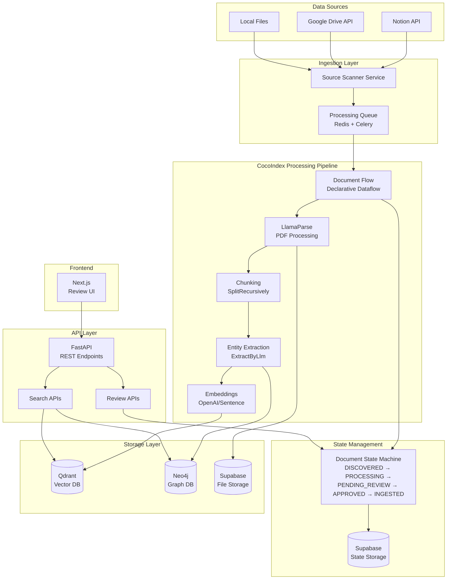

# CocoIndex Data Ingestion Portal - Architecture

## System Architecture Overview



## Core Architectural Principles

### 1. Declarative Dataflow (CocoIndex Pattern)
**CRITICAL**: All document processing MUST use CocoIndex's declarative dataflow pattern.

```python
# CORRECT PATTERN - Declarative transformations
@cocoindex.flow_def(name="DocumentIngestion")
def document_ingestion_flow(flow_builder: FlowBuilder, data_scope: DataScope):
    # Sources
    data_scope["documents"] = flow_builder.add_source(...)
    
    # Transformations with row context
    with data_scope["documents"].row() as doc:
        doc["parsed"] = doc["content"].transform(parse_document)
        doc["chunks"] = doc["parsed"].transform(
            cocoindex.functions.SplitRecursively(),
            language="markdown",
            chunk_size=1500
        )
        doc["entities"] = doc["parsed"].transform(
            cocoindex.functions.ExtractByLlm(
                llm_spec=LlmSpec(model="gpt-4"),
                output_type=list[Entity]
            )
        )
        
        # Nested row context for chunks
        with doc["chunks"].row() as chunk:
            chunk["embedding"] = chunk["text"].transform(
                cocoindex.functions.EmbedText()
            )
    
    # Exports to multiple targets
    output.export("vectors", cocoindex.targets.Qdrant())
    output.export("graph", cocoindex.targets.Neo4j())
    output.export("metadata", cocoindex.targets.Postgres())
```

**WRONG PATTERN - Imperative service calls**
```python
# DO NOT DO THIS
async def process_document(content):
    chunks = await document_processor.chunk_document(content)  # Wrong!
    for chunk in chunks:
        embedding = await embedding_service.embed(chunk)  # Wrong!
    # This breaks incremental processing and data lineage
```

### 2. Document State Machine
Every document MUST transition through defined states:

```
DISCOVERED → PROCESSING → PENDING_REVIEW → APPROVED → INGESTED
     ↓            ↓             ↓             ↓
  FAILED       FAILED        REJECTED      FAILED
```

State transitions are tracked in Supabase with full audit history.

### 3. Human-in-the-Loop Quality Control
- Every chunk can be reviewed and edited before storage
- Every entity can be corrected before graph creation
- Multi-model comparisons (GPT-4 vs Gemini) for critical extractions
- Approval workflow ensures quality over quantity

### 4. Multi-Database Architecture
Each database serves a specific purpose:

| Database | Purpose | Data Stored |
|----------|---------|-------------|
| Supabase (PostgreSQL) | Primary database & auth | Document states, user data, costs, application data |
| Supabase Schema: cocoindex | CocoIndex state tracking | Flow execution state, incremental processing cache |
| Qdrant | Vector search | Chunk embeddings, image embeddings |
| Neo4j | Knowledge graph | Entities, relationships |
| Redis | Task queue | Celery jobs, temporary data |

**Note**: Supabase provides our PostgreSQL database. We use different schemas:
- `public` schema: Application data (documents, chunks, users)
- `cocoindex` schema: CocoIndex incremental processing state
- Both use the same Supabase PostgreSQL instance

## Component Architecture

### Source Connectors
- **Notion**: Uses API token with security level tagging
- **Google Drive**: Service account authentication
- **Change Detection**: Tracks last_modified to identify updates

### Document Processing Pipeline

1. **Parsing** (LlamaParse):
   - Balanced tier ($0.10/page) - Default
   - Agentic tier ($0.40/page) - Complex layouts
   - Agentic+ tier ($1.00/page) - Critical documents

2. **Three-Tier Contextual Chunking** (Enhanced from [Anthropic's Contextual Retrieval](https://www.anthropic.com/news/contextual-retrieval)):
   
   **Three-Tier Hierarchical Structure (IMPLEMENTED):**
   ```
   Document
   ├── Page Chunks (1200 tokens) - Document overview
   │   ├── Paragraph Chunks (200-400 tokens) - Balanced retrieval
   │   │   ├── Semantic Chunks (20-100 tokens) - Ultra-precise
   │   │   │   ├── Original Text (1-3 sentences)
   │   │   │   ├── Contextual Summary (AI-generated)
   │   │   │   ├── Semantic Focus (e.g., "screen display issues")
   │   │   │   └── Contextualized Text (context + original)
   │   │   ├── Contextual Summary
   │   │   └── Contextualized Text
   │   └── Page Context
   └── Document Context
   ```
   
   **Implementation Details:**
   - Generate contextual summaries using GPT-4o-mini for each tier
   - Semantic chunks solve "vector pollution" problem
   - Each semantic chunk has identified focus/topic
   - Parent-child relationships preserved in database
   - BM25 tokens generated for hybrid search

3. **Hybrid Search Architecture**:
   - **Semantic Search**: Embeddings of contextualized chunks
   - **BM25 Search**: Lexical matching for precise keyword retrieval
   - **Fusion**: Combine results from both approaches
   - **Reranking**: Cohere reranker to select top 20 from 150 candidates
   
   **Performance Gains:**
   - Contextual chunks: 35% reduction in retrieval failures
   - + BM25: 49% reduction
   - + Reranking: 67% reduction

4. **Entity Extraction** (LLM):
   - Hybrid approach: Rules + LLM
   - 14 relationship types
   - Entity resolution for deduplication
   - Context-aware extraction using parent chunks

5. **Embeddings & Indexing**:
   - **Text Embeddings**: OpenAI text-embedding-3-small on contextualized chunks
   - **BM25 Index**: Tokenized contextualized text for lexical search
   - **Image Embeddings**: ColPali visual embeddings
   - **Storage**: Qdrant with metadata filtering

### API Architecture

#### Document Management
```
POST   /api/documents/ingest     - Queue document for processing
GET    /api/documents            - List all documents
GET    /api/documents/{id}       - Get document with chunks
PUT    /api/documents/{id}/state - Update document state
DELETE /api/documents/{id}       - Delete document
```

#### Review & Approval
```
GET    /api/queue/pending        - Get pending approvals
POST   /api/documents/{id}/approve - Approve document
POST   /api/documents/{id}/reject  - Reject document
PUT    /api/chunks/{id}          - Edit chunk text
PUT    /api/entities/{id}        - Correct entity
```

#### Search (Contextual Retrieval Implementation)
```
POST   /api/search/hybrid        - Primary search endpoint
POST   /api/search/vector        - Semantic similarity only
POST   /api/search/bm25          - Lexical search only
POST   /api/search/graph         - Graph traversal search
```

**Hybrid Search Flow:**
```python
async def hybrid_search(query: str, top_k: int = 20):
    # 1. Semantic search on contextualized chunks
    semantic_results = await qdrant.search(
        collection="chunks",
        query_vector=embed(query),
        limit=150  # Get more candidates for reranking
    )
    
    # 2. BM25 search on contextualized text
    bm25_results = await bm25_index.search(
        query=query,
        limit=150
    )
    
    # 3. Reciprocal Rank Fusion
    fused_results = reciprocal_rank_fusion(
        semantic_results, 
        bm25_results,
        k=60  # Fusion parameter
    )
    
    # 4. Rerank with Cohere
    reranked = await cohere.rerank(
        query=query,
        documents=fused_results[:150],
        top_n=top_k
    )
    
    return reranked
```

### Background Processing (Celery)
Tasks are executed asynchronously with retry logic:

```python
@celery_app.task(bind=True, max_retries=3)
def process_document(self, document_id: str):
    try:
        # 1. Update state to PROCESSING
        state_manager.transition(document_id, DocumentState.PROCESSING)
        
        # 2. Run CocoIndex flow
        flow = document_ingestion_flow()
        result = flow.run(document_id=document_id)
        
        # 3. Update state based on result
        if result.success:
            state_manager.transition(document_id, DocumentState.PENDING_REVIEW)
        else:
            state_manager.transition(document_id, DocumentState.FAILED)
            
    except Exception as exc:
        # Retry with exponential backoff
        raise self.retry(exc=exc, countdown=2 ** self.request.retries)
```

## Security Architecture

### Multi-Level Access Control
```
Level 1: Public (marketing materials)
Level 2: Client (user manuals, FAQs)  
Level 3: Partner (API docs, integrations)
Level 4: Employee (internal docs)
Level 5: Management (strategic plans)
```

Documents inherit security level from their source:
- Notion: Based on API token used
- Google Drive: Based on service account access

### API Security
- JWT authentication for all endpoints
- Rate limiting per user/endpoint
- Cost tracking for expensive operations
- Audit logging for all state changes

## Performance Requirements

| Metric | Target | Current Status |
|--------|--------|----------------|
| Document processing | < 30s | ✅ Implemented (Celery + CocoIndex) |
| Vector search latency | < 200ms | ✅ Achieved |
| Chunk editing response | < 1s | ⚠️ API implemented, needs testing |
| State transitions | < 500ms | ✅ Achieved (Supabase client) |
| Concurrent documents | 10 | ⚠️ Architecture supports, needs load testing |

## Scalability Considerations

### Current Design (< 100 documents)
- Single Celery worker sufficient
- Synchronous LLM calls acceptable
- No caching required
- Manual approval for all documents

### Future Scale (> 1000 documents)
- Multiple Celery workers with queues
- Async LLM calls with batching
- Redis caching layer
- Auto-approval based on confidence
- Horizontal scaling of API servers

## Error Handling & Recovery

### Retry Strategy
1. **Transient Failures**: Exponential backoff (2, 4, 8 seconds)
2. **API Rate Limits**: Back off and retry after limit reset
3. **Parsing Failures**: Upgrade to higher tier and retry
4. **Permanent Failures**: Mark as FAILED, notify for manual review

### State Recovery
- All state transitions are logged
- Can replay from any state
- Idempotent operations prevent duplicates
- Manual intervention UI for stuck documents

## Monitoring & Observability

### Metrics to Track
- Document processing times
- State transition frequencies
- API call costs
- Error rates by component
- Search latency percentiles

### Logging Strategy
- Structured JSON logging
- Trace IDs across services
- Error aggregation in Sentry
- Cost tracking in database

## Development Workflow

### Local Development
```bash
# Start infrastructure
docker-compose up -d

# Start backend
python -m uvicorn app.main:app --reload

# Start worker
python -m celery -A app.worker worker --loglevel=info

# Start frontend
cd frontend && npm run dev
```

### Testing Strategy
1. **Unit Tests**: Service methods
2. **Integration Tests**: CocoIndex flows
3. **E2E Tests**: API → Processing → Storage
4. **Performance Tests**: Search latency

### Deployment
- Railway for application hosting
- Managed databases (Supabase, Neo4j Aura)
- GitHub Actions for CI/CD
- Environment-based configuration

## Critical Implementation Notes

### ✅ Completed Features (2025-08-25)
1. **Document Processing Trigger** - Celery task queue integration working
2. **Supabase Integration** - Using Supabase client for all database operations
3. **SSE Streaming** - Real-time status updates implemented
4. **State Management** - Document state transitions tracked in Supabase
5. **Security Model** - 5-tier access control implemented
6. **Source Connectors** - Notion and Google Drive connectors tested and working
7. **LlamaParse Integration** - Document content extraction implemented
8. **Frontend UI** - Processing status, spinners, and auto-refresh working
9. **API Bridge Pattern** - Endpoints fetch from Qdrant/Neo4j for display
10. **Three-Tier Chunking** - Page → Paragraph → Semantic hierarchy implemented
11. **Contextual Summaries** - AI-generated context for all chunk levels
12. **Semantic Focus Identification** - Each semantic chunk tagged with key concept
13. **Hierarchical Display** - Frontend shows parent-child chunk relationships

### ✅ Resolved Issues (2025-08-25)
1. **Table Naming** - Fixed: Now using correct 'chunks' and 'entities' tables
2. **Data Persistence** - Fixed: Chunks save correctly with all fields mapped
3. **Frontend Display** - Fixed: Hierarchical chunks display properly

### ⚠️ Next Implementation Phase
1. **Embedding Generation**
   - Generate embeddings for contextualized text
   - Store in Qdrant with metadata
   - Support for both semantic and BM25 search

2. **Hybrid Search Implementation**
   - Semantic search on embeddings
   - BM25 search on tokenized text
   - Reciprocal rank fusion
   - Cohere reranking for top results

### ⚠️ In Progress
1. **Embedding Generation** - Next priority for search functionality
2. **Hybrid Search API** - Combine semantic + BM25 search
3. **Entity CRUD Endpoints** - Partially implemented
4. **Manual Review Workflow** - UI exists, backend needs completion

### Common Pitfalls to Avoid
- Don't use imperative processing - breaks incremental updates
- Don't skip state tracking - loses document history
- Don't mock integrations - use real APIs from day 1
- Don't optimize prematurely - quality over performance

### Success Criteria
✅ When these are true, the system is ready:
- [x] Documents flow from source to Supabase (discovered state)
- [x] State transitions are tracked and auditable
- [x] Documents fully process with chunks visible in three-tier hierarchy
- [x] Every chunk can be reviewed before storage
- [ ] Search returns results in < 200ms (needs embeddings)
- [ ] Costs are tracked for all operations
- [x] Failures are recoverable without data loss

### Immediate Action Items
1. **Generate Embeddings** - Create vectors for all contextualized chunks
2. **Implement Hybrid Search** - Semantic + BM25 with fusion
3. **Add Reranking** - Integrate Cohere for final 67% accuracy boost
4. **Complete Entity Extraction** - Extract and store entities in Neo4j

## References
- [CocoIndex Documentation](https://cocoindex.io/docs)
- [urgentTasks.md](./urgentTasks.md) - Immediate action items
- [CLAUDE.md](./CLAUDE.md) - Development context
- [successCriteria.md](./successCriteria.md) - Project requirements