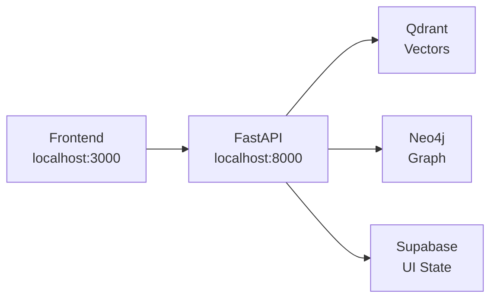

# Frontend Implementation Plan - PoC Focus

## Overview
This document outlines the connection between the **existing frontend** (already built and running at localhost:3000) and our **updated backend** with API Bridge Pattern.

## Current Status ✅
- **Frontend**: Already built with Next.js, running at localhost:3000
- **Backend**: API Bridge endpoints created for Qdrant/Neo4j access
- **Issue**: Frontend expects different endpoint paths than backend provides

## Core Goals
✅ Connect existing frontend to updated backend endpoints  
✅ Maintain <200ms search latency with API Bridge  
✅ Enable chunk/entity editing with proper data flow  
✅ Implement SSE for real-time updates  
✅ Test all connections thoroughly  

## Architecture Context

### API Bridge Pattern (Already Implemented ✅)


## Phase 0: API Endpoint Alignment 🔴 IMMEDIATE NEED

### Current Frontend → Backend Mismatches

| Frontend Expects | Backend Provides | Status | Action Needed |
|-----------------|------------------|---------|---------------|
| `/api/documents/` | `/api/documents` | ✅ Works | None |
| `/api/documents/{id}` | `/api/documents/{id}` | ✅ Works | None |
| `/api/documents/{id}/chunks` | `/api/documents/{id}/chunks` | ✅ Exists | Verify data format |
| `/api/entities/{documentId}` | `/api/documents/{id}/entities` | ❌ Mismatch | **Add redirect or alias** |
| `/api/chunks/{id}` | Not implemented | ❌ Missing | **Create endpoint** |
| `/api/entities/{id}` | Not implemented | ❌ Missing | **Create endpoint** |
| `/api/documents/{id}/relationships` | `/api/documents/{id}/relationships` | ✅ Exists | Verify working |
| `/api/process/notion` | `/api/processing/notion` | ❌ Mismatch | **Fix path** |
| `/api/process/gdrive` | `/api/processing/gdrive` | ❌ Mismatch | **Fix path** |
| `/api/health` | `/api/health` | ✅ Works | None |

### Data Format Mismatches

#### Chunk Object
```typescript
// Frontend expects:
{
  id: string;
  document_id: string;
  chunk_number: number;
  chunk_text: string;  // ⚠️ Frontend uses 'chunk_text'
  chunk_size: number;
  metadata: Record<string, any>;
}

// Backend returns:
{
  id: string;
  document_id: string;
  chunk_number: number;
  text: string;  // ⚠️ Backend uses 'text'
  metadata: Record<string, any>;
}
```
**Action**: Update backend to use `chunk_text` field name

#### Entity Object
```typescript
// Frontend expects:
{
  id: string;
  document_id: string;
  entity_type: string;  // ⚠️ Frontend uses 'entity_type'
  entity_name: string;  // ⚠️ Frontend uses 'entity_name'
  confidence: number;
  metadata: Record<string, any>;
}

// Backend returns:
{
  id: string;
  name: string;  // ⚠️ Backend uses 'name'
  type: string;  // ⚠️ Backend uses 'type'
  confidence: number;
  metadata: Record<string, any>;
}
```
**Action**: Update backend to match frontend field names

## Phase 1: Backend API Fixes (IMMEDIATE - 1 hour)

### Task 1: Fix Entity Endpoint Path
**File**: `app/api/entities.py`
```python
# Add alias route for frontend compatibility
@router.get("/api/entities/{document_id}")
async def get_entities_by_document(document_id: str):
    # Redirect to bridge endpoint
    return await get_document_entities(document_id)
```

### Task 2: Fix Field Name Mappings
**File**: `app/api/bridge.py`
```python
# Update chunk response format
chunks.append({
    "id": str(point.id),
    "chunk_number": point.payload.get("chunk_number", 0),
    "chunk_text": point.payload.get("text", ""),  # Rename to chunk_text
    "chunk_size": len(point.payload.get("text", "")),  # Add chunk_size
    "document_id": document_id,
    "metadata": point.payload.get("metadata", {})
})

# Update entity response format
entities.append({
    "id": record.get("id", ""),
    "entity_name": record.get("name", ""),  # Rename to entity_name
    "entity_type": record.get("type", "Unknown"),  # Rename to entity_type
    "document_id": document_id,  # Add document_id
    "confidence": record.get("confidence", 0.0),
    "metadata": record.get("metadata", {})
})
```

### Task 3: Add Missing CRUD Endpoints
**File**: `app/api/chunks.py`
```python
@router.put("/api/chunks/{chunk_id}")
async def update_chunk(chunk_id: str, chunk_text: str):
    # Update chunk in Qdrant
    # Update chunk in Supabase
    pass

@router.delete("/api/chunks/{chunk_id}")
async def delete_chunk(chunk_id: str):
    # Delete from Qdrant
    # Delete from Supabase
    pass
```

**File**: `app/api/entities.py`
```python
@router.put("/api/entities/{entity_id}")
async def update_entity(entity_id: str, data: dict):
    # Update entity in Neo4j
    # Update entity in Supabase
    pass

@router.delete("/api/entities/{entity_id}")
async def delete_entity(entity_id: str):
    # Delete from Neo4j
    # Delete from Supabase
    pass

@router.post("/api/entities")
async def create_entity(entity: dict):
    # Create in Neo4j
    # Create in Supabase
    pass
```

### Task 4: Fix Processing Endpoint Paths
**File**: `app/api/processing.py`
```python
# Change route prefix from /api/processing to /api/process
router = APIRouter(prefix="/api/process", tags=["processing"])
```

## Phase 2: Test Connection (30 minutes)

### Test Script 1: Verify Frontend Can Access Backend
```bash
# test_frontend_backend_connection.py
import requests
import json

BASE_URL = "http://localhost:8000"

def test_endpoints():
    # Test document list
    resp = requests.get(f"{BASE_URL}/api/documents/")
    print(f"Documents endpoint: {resp.status_code}")
    
    if resp.status_code == 200:
        docs = resp.json()
        if docs:
            doc_id = docs[0]['id']
            
            # Test chunks endpoint
            resp = requests.get(f"{BASE_URL}/api/documents/{doc_id}/chunks")
            print(f"Chunks endpoint: {resp.status_code}")
            
            # Test entities endpoint  
            resp = requests.get(f"{BASE_URL}/api/entities/{doc_id}")
            print(f"Entities endpoint: {resp.status_code}")

if __name__ == "__main__":
    test_endpoints()
```

### Test Script 2: Verify Data Formats Match
```python
# test_data_formats.py
def verify_chunk_format(chunk):
    required_fields = ['id', 'document_id', 'chunk_number', 'chunk_text', 'chunk_size']
    for field in required_fields:
        assert field in chunk, f"Missing field: {field}"
    print("✅ Chunk format correct")

def verify_entity_format(entity):
    required_fields = ['id', 'document_id', 'entity_type', 'entity_name', 'confidence']
    for field in required_fields:
        assert field in entity, f"Missing field: {field}"
    print("✅ Entity format correct")
```

## Phase 3: Complete Implementation Checklist

### Backend Tasks (Priority Order)
- [ ] Fix field name mappings in `/api/documents/{id}/chunks` (chunk_text, chunk_size)
- [ ] Fix field name mappings in `/api/documents/{id}/entities` (entity_name, entity_type)
- [ ] Add `/api/entities/{document_id}` alias endpoint
- [ ] Implement `/api/chunks/{id}` PUT endpoint
- [ ] Implement `/api/chunks/{id}` DELETE endpoint
- [ ] Implement `/api/entities/{id}` PUT endpoint
- [ ] Implement `/api/entities/{id}` DELETE endpoint
- [ ] Implement `/api/entities` POST endpoint
- [ ] Fix processing endpoint paths (/api/processing → /api/process)
- [ ] Test all endpoints with frontend

### Frontend Verification Tasks
- [ ] Test document list loading
- [ ] Test document detail page
- [ ] Test chunk display with correct fields
- [ ] Test entity display with correct fields
- [ ] Test chunk editing functionality
- [ ] Test entity editing functionality
- [ ] Test search functionality
- [ ] Verify SSE real-time updates

### Integration Tests
- [ ] End-to-end document processing
- [ ] Chunk editing and persistence
- [ ] Entity management workflow
- [ ] Search latency (<200ms)
- [ ] Real-time status updates

## Quick Action Points

### 🔴 IMMEDIATE (Do First - 1 hour)
1. **Fix API Bridge field mappings** → Update `app/api/bridge.py`
2. **Add entity endpoint alias** → Update `app/api/entities.py`  
3. **Fix processing paths** → Update `app/api/processing.py`
4. **Test with frontend** → Run `test_frontend_backend_connection.py`

### 🟡 NEXT (After API fixes - 2 hours)
5. **Implement chunk CRUD** → Create missing endpoints
6. **Implement entity CRUD** → Create missing endpoints
7. **Test all operations** → Verify data persistence

### 🟢 FINALLY (Polish - 1 hour)
8. **Verify SSE works** → Test real-time updates
9. **Check search latency** → Must be <200ms
10. **Run integration tests** → Full workflow validation

## Success Criteria
✅ Frontend loads documents from backend  
✅ Chunks display with correct field names  
✅ Entities display with correct field names  
✅ Editing operations persist to databases  
✅ Search returns results in <200ms  
✅ SSE provides real-time updates  

## Notes
- Frontend is already built and functional
- Backend API Bridge is working but needs field name adjustments
- Priority is connecting the two systems, not rebuilding either
- Focus on data format compatibility and endpoint alignment